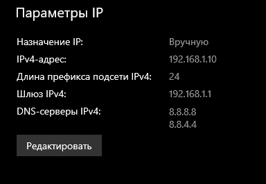

 python C:\stuff\пики_с_осциллографа\oscilloscope_stream.py --host "TCPIP::192.168.1.4::INSTR" --backend visa --frames 1 --waveform-mode RAW --waveform-points-mode RAW --timeout 60 --channel CHAN2 --baseline edges --threshold 0.15 --polarity positive --detection-mode 
above-threshold-samples

### режим дебага 
python C:\stuff\пики_с_осциллографа\oscilloscope_stream.py --gui --dummy True --dummy-csv live_signal.csv --baseline edges --interval 1 --threshold 1.5 --polarity positive --min-distance-samples 5

### В настройках "сеть и мобильные устройства/Ethernet"
